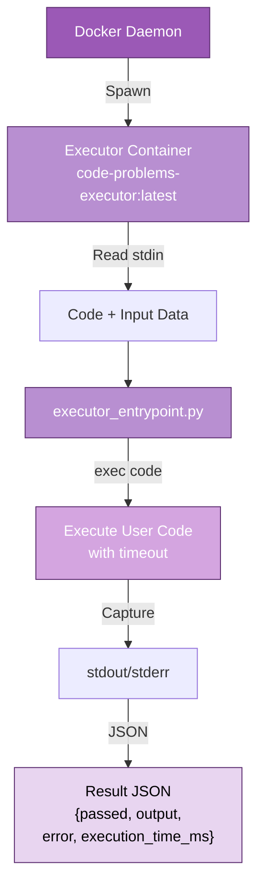

```mermaid
graph TB
    DOCKER["Docker Daemon"]
    CONTAINER["Executor Container<br/>code-problems-executor:latest"]
    EXEC["executor_entrypoint.py"]
    
    DOCKER -->|Spawn| CONTAINER
    CONTAINER -->|Read stdin| INPUT["Code + Input Data"]
    INPUT --> EXEC
    EXEC -->|exec code| RUN["Execute User Code<br/>with timeout"]
    RUN -->|Capture| OUTPUT["stdout/stderr"]
    OUTPUT -->|JSON| RESULT["Result JSON<br/>{passed, output,<br/>error, execution_time_ms}"]
    
    style DOCKER fill:#9B59B6,stroke:#5B2C6F,color:#fff
    style CONTAINER fill:#B88FD1,stroke:#5B2C6F,color:#fff
    style EXEC fill:#B88FD1,stroke:#5B2C6F,color:#fff
    style RUN fill:#D4A5E0,stroke:#5B2C6F,color:#fff
    style RESULT fill:#E8D5F0,stroke:#5B2C6F,color:#000
```
