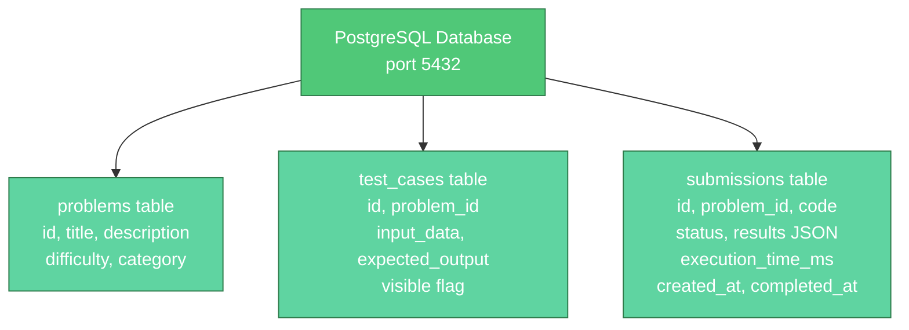

```mermaid
graph TB
    DB["PostgreSQL Database<br/>port 5432"]
    
    DB --> PROBLEMS["problems table<br/>id, title, description<br/>difficulty, category"]
    DB --> TESTCASES["test_cases table<br/>id, problem_id<br/>input_data, expected_output<br/>visible flag"]
    DB --> SUBMISSIONS["submissions table<br/>id, problem_id, code<br/>status, results JSON<br/>execution_time_ms<br/>created_at, completed_at"]
    
    style DB fill:#50C878,stroke:#2D7A4A,color:#fff
    style PROBLEMS fill:#5FD4A1,stroke:#2D7A4A,color:#fff
    style TESTCASES fill:#5FD4A1,stroke:#2D7A4A,color:#fff
    style SUBMISSIONS fill:#5FD4A1,stroke:#2D7A4A,color:#fff
```
