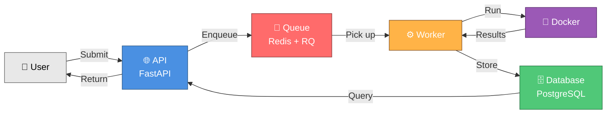

```mermaid
graph LR
    USER["👤 User"]
    API["🌐 API<br/>FastAPI"]
    QUEUE["📮 Queue<br/>Redis + RQ"]
    WORKER["⚙️ Worker"]
    DOCKER["🐳 Docker"]
    DB["🗄️ Database<br/>PostgreSQL"]
    
    USER -->|Submit| API
    API -->|Enqueue| QUEUE
    QUEUE -->|Pick up| WORKER
    WORKER -->|Run| DOCKER
    DOCKER -->|Results| WORKER
    WORKER -->|Store| DB
    DB -->|Query| API
    API -->|Return| USER
    
    style USER fill:#E8E8E8,stroke:#666,color:#000
    style API fill:#4A90E2,stroke:#2E5C8A,color:#fff
    style QUEUE fill:#FF6B6B,stroke:#8B3A3A,color:#fff
    style WORKER fill:#FFB347,stroke:#8B5A2B,color:#fff
    style DOCKER fill:#9B59B6,stroke:#5B2C6F,color:#fff
    style DB fill:#50C878,stroke:#2D7A4A,color:#fff
```

