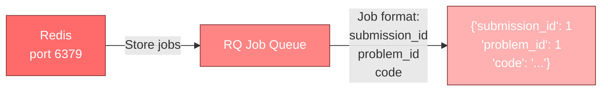

```mermaid
graph LR
    REDIS["Redis<br/>port 6379"]
    QUEUE["RQ Job Queue"]
    
    REDIS -->|Store jobs| QUEUE
    QUEUE -->|Job format:<br/>submission_id<br/>problem_id<br/>code| JOB["{'submission_id': 1<br/>'problem_id': 1<br/>'code': '...'}"]
    
    style REDIS fill:#FF6B6B,stroke:#8B3A3A,color:#fff
    style QUEUE fill:#FF8585,stroke:#8B3A3A,color:#fff
    style JOB fill:#FFB0B0,stroke:#8B3A3A,color:#fff
```