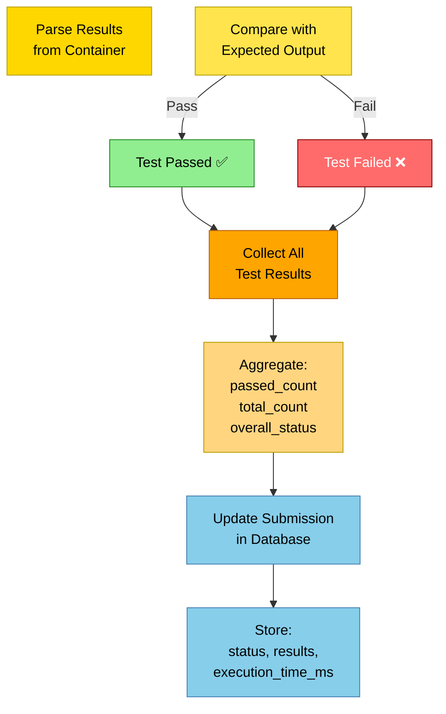

```mermaid
graph TB
    PARSE["Parse Results<br/>from Container"]
    CHECK["Compare with<br/>Expected Output"]
    
    CHECK -->|Pass| PASS["Test Passed ✅"]
    CHECK -->|Fail| FAIL["Test Failed ❌"]
    
    PASS --> COLLECT["Collect All<br/>Test Results"]
    FAIL --> COLLECT
    
    COLLECT --> AGGREGATE["Aggregate:<br/>passed_count<br/>total_count<br/>overall_status"]
    
    AGGREGATE --> UPDATE["Update Submission<br/>in Database"]
    UPDATE --> STORE["Store:<br/>status, results,<br/>execution_time_ms"]
    
    style PARSE fill:#FFD700,stroke:#B8A000,color:#000
    style CHECK fill:#FFE44D,stroke:#B8A000,color:#000
    style PASS fill:#90EE90,stroke:#228B22,color:#000
    style FAIL fill:#FF6B6B,stroke:#8B0000,color:#fff
    style COLLECT fill:#FFA500,stroke:#B8600B,color:#000
    style AGGREGATE fill:#FFD580,stroke:#B8A000,color:#000
    style UPDATE fill:#87CEEB,stroke:#4682B4,color:#000
    style STORE fill:#87CEEB,stroke:#4682B4,color:#000
```

