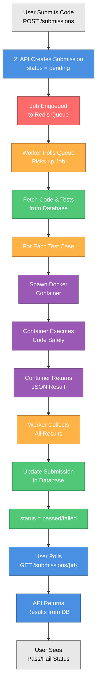

```mermaid
graph TD
    A["User Submits Code<br/>POST /submissions"] --> B["2. API Creates Submission<br/>status = pending"]
    B --> C["Job Enqueued<br/>to Redis Queue"]
    C --> D["Worker Polls Queue<br/>Picks up Job"]
    D --> E["Fetch Code & Tests<br/>from Database"]
    E --> F["For Each Test Case"]
    F --> G["Spawn Docker<br/>Container"]
    G --> H["Container Executes<br/>Code Safely"]
    H --> I["Container Returns<br/>JSON Result"]
    I --> J["Worker Collects<br/>All Results"]
    J --> K["Update Submission<br/>in Database"]
    K --> L["status = passed/failed"]
    L --> M["User Polls<br/>GET /submissions/{id}"]
    M --> N["API Returns<br/>Results from DB"]
    N --> O["User Sees<br/>Pass/Fail Status"]
    
    style A fill:#E8E8E8,stroke:#666,color:#000
    style B fill:#4A90E2,stroke:#2E5C8A,color:#fff
    style C fill:#FF6B6B,stroke:#8B3A3A,color:#fff
    style D fill:#FFB347,stroke:#8B5A2B,color:#fff
    style E fill:#50C878,stroke:#2D7A4A,color:#fff
    style F fill:#FFB347,stroke:#8B5A2B,color:#fff
    style G fill:#9B59B6,stroke:#5B2C6F,color:#fff
    style H fill:#9B59B6,stroke:#5B2C6F,color:#fff
    style I fill:#9B59B6,stroke:#5B2C6F,color:#fff
    style J fill:#FFB347,stroke:#8B5A2B,color:#fff
    style K fill:#50C878,stroke:#2D7A4A,color:#fff
    style L fill:#50C878,stroke:#2D7A4A,color:#fff
    style M fill:#4A90E2,stroke:#2E5C8A,color:#fff
    style N fill:#4A90E2,stroke:#2E5C8A,color:#fff
    style O fill:#E8E8E8,stroke:#666,color:#000
```

