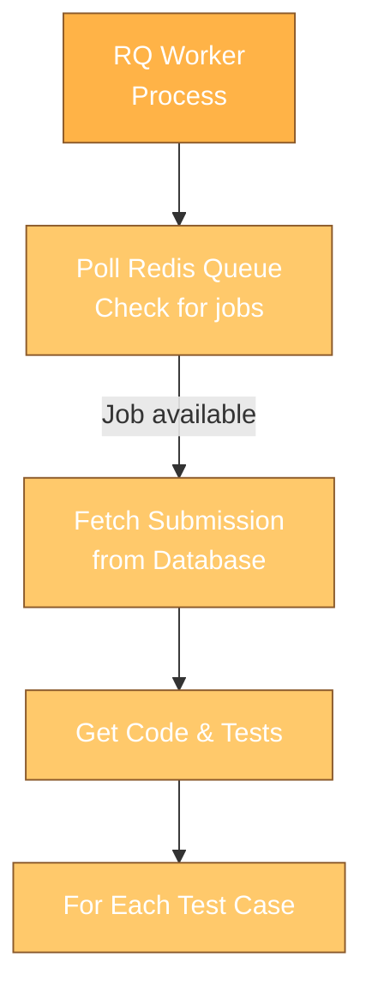

```mermaid
graph TB
    WORKER["RQ Worker<br/>Process"]
    
    WORKER --> POLL["Poll Redis Queue<br/>Check for jobs"]
    POLL -->|Job available| FETCH["Fetch Submission<br/>from Database"]
    FETCH --> GET_CODE["Get Code & Tests"]
    GET_CODE --> LOOP["For Each Test Case"]
    
    style WORKER fill:#FFB347,stroke:#8B5A2B,color:#fff
    style POLL fill:#FFC96B,stroke:#8B5A2B,color:#fff
    style FETCH fill:#FFC96B,stroke:#8B5A2B,color:#fff
    style GET_CODE fill:#FFC96B,stroke:#8B5A2B,color:#fff
    style LOOP fill:#FFC96B,stroke:#8B5A2B,color:#fff
```