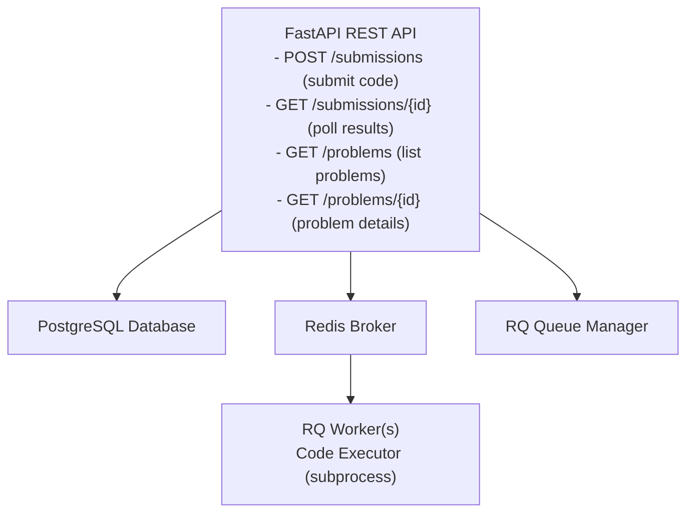

# Initial architecture





## Tech Stack
  

- **Backend**: FastAPI + Uvicorn
- **Database**: PostgreSQL with SQLAlchemy ORM
- **Job Queue**: Redis + RQ (Redis Queue)
- **Testing**: Pytest
- **Containerization**: Docker & Docker Compose

> [!NOTE] Uvicorn
> uvicorn is an ASGI (async server gateway interface) compatible web server. It's (simplified) the binding element that handles the web connections from the browser or api client and then allows FastAPI to serve the actual request.
> 
> uvicorn listens on a socket, receives the connection, does a bit processing and hands the request over to FastAPI, according to the ASGI interface.

![[How Django Interacts with Databases#Introduction to ORMs]]


## Project Structure

```
backend/
├── app/
│   ├── main.py                 # FastAPI app entry point
│   ├── db/
│   │   ├── base.py            # SQLAlchemy Base
│   │   ├── config.py          # Database connection
│   │   ├── init_db.py         # Seed data initialization
│   │   └── utils.py           # Database utilities
│   ├── models/                # SQLAlchemy ORM models
│   │   ├── problem.py
│   │   ├── test_case.py
│   │   └── submission.py
│   ├── schemas/               # Pydantic validation schemas
│   │   ├── problem.py
│   │   ├── test_case.py
│   │   └── submission.py
│   ├── api/                   # FastAPI route handlers
│   │   ├── problems.py
│   │   └── submissions.py
│   ├── services/              # Business logic
│   │   └── submission_service.py
│   └── workers/               # RQ job handlers
│       └── executor.py        # Code execution logic
├── tests/
│   ├── test_executor.py       # Unit tests for code executor
│   └── test_api.py           # Integration tests for API
├── Dockerfile
├── docker-compose.yml
├── requirements.txt
└── README.md
```

# Executing code on a Worker rather than a Subprocess

### Before

```
User submits code
  ↓
subprocess.run([python, "-c", code])  # On host Python
  ↓
Output compared against expected
```

### After

```
User submits code
  ↓
Docker container spawned:
  ├─ Isolated filesystem
  ├─ Limited memory (256MB)
  ├─ No root privileges
  └─ Timeout enforced
  ↓
Container executor runs code safely
  ↓
Output compared against expected
  ↓
Container removed
```

### Executor Docker Image

**Files created**:
- Dockerfile.executor — Lightweight Python 3.11 image (~200MB)
- executor_entrypoint.py — Isolated code execution script

**What it does**:

- Runs in a restricted container environment
- Reads code + test input from stdin
- Executes user code safely with timeout
- Outputs JSON result: {passed, output, error, execution_time_ms}
- Security features:
	- Drop all Linux capabilities
	- Disable privilege escalation
	- Read-only filesystem (except tmp)
	- Memory limited to 256MB

### **2. Docker-Based Code Executor**

**File modified:** executor.py

**Key changes:**

- Replaced subprocess.run() with Docker SDK
- Execute code in containers instead of host Python
- New functions:
    - get_docker_client() — Lazy-init Docker client
    - prepare_container_input() — Format input for executor
    - execute_in_container() — Run isolated container execution
    - execute_user_code() — Test runner (calls container for each test)


### code_problems_worker

```
Container lifecycle: Runs continuously (never stops)
Role: Job processor and orchestrator
Responsibilities:
  ✅ Poll Redis queue continuously
  ✅ Pick up submission jobs
  ✅ Fetch code + test cases from database
  ✅ Manage test case execution
  ✅ Coordinate with executor containers
  ✅ Aggregate results
  ✅ Update database with final results
  
Stays running: 24/7 waiting for jobs
```

```
worker:
  command: rq worker -u redis://redis:6379  # Never exits, always polling
  volumes:
    - /var/run/docker.sock:/var/run/docker.sock  # Needs Docker daemon access
```

### code-problems-executor

```
Container lifecycle: Spawned & destroyed per execution
Role: Safe, isolated code execution
Responsibilities:
  ✅ Read user code from stdin
  ✅ Execute code in isolated environment
  ✅ Capture output + errors
  ✅ Return JSON result
  ✅ Exit immediately
  
Exists for: ~100-500ms per test case
```

```
docker_client.containers.run(
    "code-problems-executor:latest",  # Spawn fresh container
    input=container_input,             # Pass code via stdin
    timeout=timeout + 5,               # Kill if too slow
    mem_limit="256m",                  # Resource limits
    # ... security options
)
# Container auto-removed after execution
```